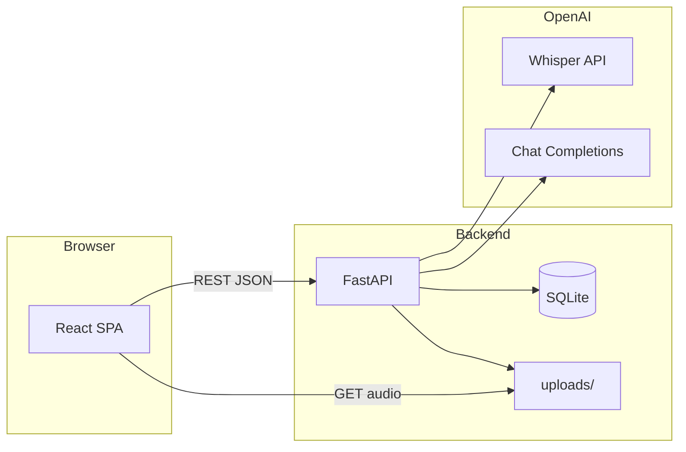

# Call Intelligence Platform — Project Documentation

## 1. Purpose

The **Call Intelligence Platform** is a hackathon-style web application for **sales call recordings**. Users upload audio files; the system **transcribes** them with OpenAI Whisper and **analyzes** the transcript with an OpenAI chat model to produce scores, summaries, keywords, action items, and questionnaire-style coverage. A React dashboard lists calls and a detail view shows playback, charts, and insights.

---

## 2. Technology Stack

| Area | Technology | Role |
|------|------------|------|
| **Frontend** | React 18 | UI components and state |
| **Frontend build** | Vite 5 | Dev server, production bundle |
| **Styling** | Tailwind CSS 3, PostCSS, Autoprefixer | Layout and visual design |
| **Routing** | React Router 6 | `/` (dashboard), `/calls/:id` (detail) |
| **HTTP client** | Axios | REST calls to the backend |
| **Audio UI** | WaveSurfer.js 7 | Waveform and playback |
| **Charts** | Recharts 2 | Donut (talk time), bar charts (scores) |
| **Backend** | Python 3.10+, FastAPI | REST API, CORS, static file serving |
| **ORM / DB** | SQLAlchemy | Persistence |
| **Database** | SQLite (`call_intelligence.db`) | Call metadata and analysis results |
| **File uploads** | FastAPI `UploadFile`, `python-multipart` | Multipart audio upload |
| **Async I/O** | `aiofiles` (dependency) | Compatible with async upload patterns |
| **Transcription** | OpenAI API — `whisper-1`, `verbose_json` | Speech-to-text + duration |
| **Analysis** | OpenAI Chat Completions — default `gpt-4o-mini` | Structured JSON analysis from transcript |
| **Config** | `python-dotenv` | Environment variables |
| **Deployment (optional)** | Docker Compose, nginx | Backend API + static frontend (see root `README.md`) |

---

## 3. High-Level Architecture

- The **frontend** talks to the API over HTTP (base URL from `VITE_API_BASE_URL`).
- The API **stores** each call in SQLite and **writes** audio under `uploads/` (path under `DATA_DIR` or backend root).
- The same app **mounts** `/uploads` so the browser can load audio URLs for WaveSurfer.
- **OpenAI** is used only on the server (API key never shipped to the client in production patterns).

---

## 4. Core Data Model (`Call`)

Each row represents one uploaded recording and its pipeline state.

| Concept | Storage | Notes |
|---------|---------|--------|
| Identity | `id`, `created_at` | Auto-increment primary key |
| File | `filename`, `file_path` | Original name + stored path (UUID + extension) |
| Pipeline | `status` | See lifecycle below |
| Transcription | `transcript`, `duration_seconds` | From Whisper |
| High-level analysis | `overall_score`, `sentiment`, `summary` | From chat model |
| Talk-time estimates | `agent_talk_time_percent`, `customer_talk_time_percent` | Model-estimated from transcript |
| Dimension scores | `communication_clarity_score`, `politeness_score`, `business_knowledge_score`, `problem_handling_score`, `listening_ability_score` | Numeric 1–10 style |
| Structured lists | `keywords`, `action_items`, `positive_observations`, `negative_observations` | JSON arrays |
| Sales checklist | `questionnaire_coverage` | JSON object of topic → boolean |

---

## 5. Call Status Lifecycle

Typical progression:

1. **`uploaded`** — File saved; row created after `POST /api/calls/upload`.
2. **`transcribing`** — Set when `POST /api/analyze/{id}` starts; background job runs Whisper.
3. **`analyzing`** — Transcript and duration saved; chat analysis runs.
4. **`complete`** — All analysis fields persisted.
5. **`error`** — Failure in transcription or analysis (logged server-side).

If analysis is already running (`transcribing` or `analyzing`), a duplicate analyze request returns **409 Conflict**.

---

## 6. How It Works (End-to-End)

### 6.1 Upload

1. User selects an audio file (allowed: `.mp3`, `.wav`, `.m4a`, `.ogg`).
2. Frontend sends **multipart** `POST /api/calls/upload`.
3. Backend validates extension, writes a unique file under `uploads/`, inserts `Call` with `status: uploaded`.
4. Response returns `id`, `filename`, `status`.

### 6.2 Analyze (background pipeline)

1. Frontend calls **`POST /api/analyze/{id}`**.
2. Backend sets `transcribing` and schedules **`run_analysis_pipeline`** (FastAPI `BackgroundTasks`).
3. **Transcription**: `transcribe_audio` calls Whisper; saves `transcript` and `duration_seconds`; sets `analyzing`.
4. **Analysis**: `analyze_call` sends the transcript to the chat model with a fixed JSON schema in the system prompt; parses JSON (with fallback if invalid).
5. Fields are mapped onto the `Call` row; `status` becomes **`complete`** (or **`error`** on exception).

### 6.3 Polling and detail view

- While processing, the UI **polls** `GET /api/calls/{id}` (e.g. every few seconds) until `complete` or `error`.
- **Call detail** loads the call, plays audio from `/uploads/{stored_filename}`, and renders Recharts for talk-time and scores, plus lists for keywords, actions, observations, and questionnaire coverage.

### 6.4 List and delete

- **`GET /api/calls`** — All calls, newest first.
- **`DELETE /api/calls/{id}`** — Removes DB row and deletes the file on disk if present.

---

## 7. REST API Summary

| Method | Path | Description |
|--------|------|-------------|
| `POST` | `/api/calls/upload` | Multipart file upload; creates call |
| `GET` | `/api/calls` | List calls |
| `GET` | `/api/calls/{id}` | Single call (for polling and detail) |
| `DELETE` | `/api/calls/{id}` | Delete call + file |
| `POST` | `/api/analyze/{id}` | Start transcription + analysis pipeline |
| `GET` | `/uploads/...` | Static audio (mounted by FastAPI) |

---

## 8. Configuration

### Backend (`backend/.env`)

- **`OPENAI_API_KEY`** — Required for Whisper and chat analysis.
- **`OPENAI_MODEL`** — Optional; defaults to `gpt-4o-mini` for analysis.
- **`DATA_DIR`** — Optional; root for SQLite DB and `uploads/` (default: backend directory).
- **`CORS_ORIGINS`** — Optional comma-separated list; defaults include local Vite and Docker web port.

### Frontend (`frontend/.env`)

- **`VITE_API_BASE_URL`** — Backend origin, e.g. `http://localhost:8000`.

---

## 9. Frontend Routes

| Path | Page | Role |
|------|------|------|
| `/` | `Dashboard` | Upload, list calls, trigger analysis, delete, link to detail |
| `/calls/:id` | `CallDetail` | Waveform, metrics, full analysis |

---

## 10. Operational Notes

- **Docker**: See root `README.md` — `setup.sh`, `docker compose`, nginx for static frontend; data can persist in a volume.
- **Frontend rebuild in Docker**: Static assets are baked into the image; use `cacheclean.sh` after UI changes if applicable.
- **Security**: Treat as a **demo/hackathon** stack — no built-in auth; protect API and keys in real deployments.

---

## 11. License / Use

Hackathon / demo use (as stated in project README).
